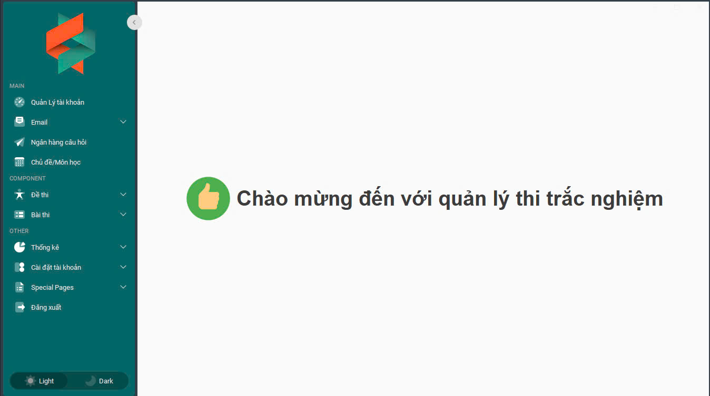

# JBDC - JAVA MYSQL

## Details  
initMenuEvent(MainForm.java) call Components Modules

  

step 1 : mvm clean install 
step2 : close visual studio code , after open visual studio code
step3 : run Main : mvn exec:java -Dexec.mainClass="com.example.MainPfor