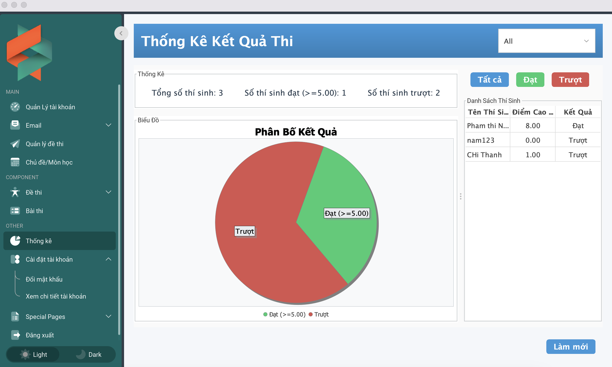

# JBDC - JAVA MYSQL

## Details  
initMenuEvent(MainForm.java) call Components Modules

 

  

 
 

 

step 1 : mvm clean install 
step2 : close visual studio code , after open visual studio code
step3 : run Main : mvn exec:java -Dexec.mainClass="com.example.MainPform
insert test-> result -> exams